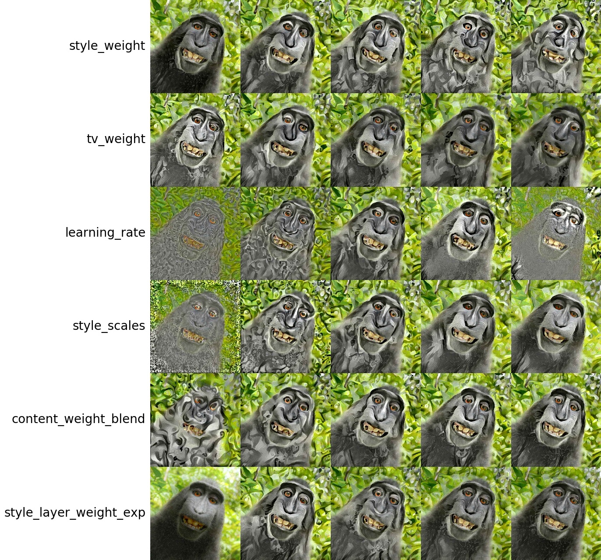
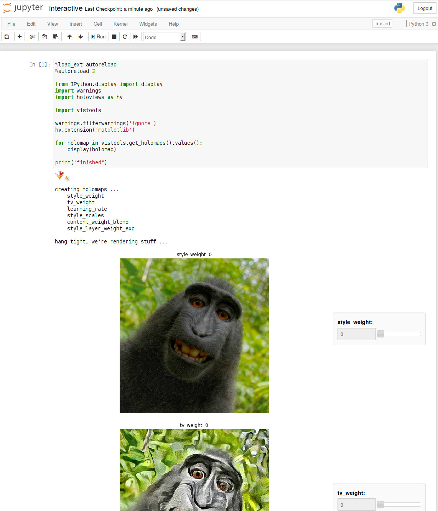

Code used in a parameter study, published in this [blog post], to scan
hyper-parameters of an [Artistic Style Transfer deep learning
application][code].

In an nutshell, we transfer the artistic style of one image (the painting
in the middle) to the content of another (the fellow on the left).

Since it is hard to write down a computable metric for "visually appealing"
that would let us formulate an optimization problem, we resort to running a
scan of the method's hyper-parameters, using the [psweep] package.

We have compressed and packaged all important results of the study in this
repo. Click the Binder badge above to launch a Jupyter notebook and browse the
study's results. When it has finished loading, click Run and use the sliders to
start exploring.

[blog post]: https://www.cloudandheat.com/gpu-cloud-showcase-neural-style-transfer-parameter-study-using-multiple-nvidia-p100-gpus
[code]: https://github.com/elcorto/neural-style
[psweep]: https://pypi.org/project/psweep
